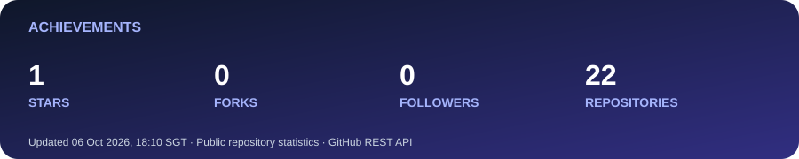
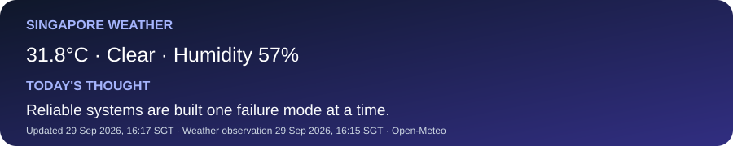

# Felix Ren

### Software Engineer · AI Engineering · Distributed Systems

Building AI systems, distributed backend services, and real-time applications.

## Engineering focus

- **AI systems:** RAG pipelines, vector retrieval, LLM integration, semantic search.
- **Backend and distributed systems:** Spring Boot, Spring Cloud, messaging, caching, data stores, observability.
- **Real-time systems:** event-driven processing, streaming data, low-latency visualization.

## Stack

| Area | Tools |
| --- | --- |
| Languages | Java · Python · TypeScript |
| AI | LangChain4j · RAG · Pinecone · embeddings |
| Backend | Spring Boot · Spring Cloud · REST · SSE |
| Messaging and data | Kafka · RabbitMQ · MQTT · Redis · MongoDB · MySQL |
| Interface and infrastructure | Next.js · Canvas · ECharts · Docker · Linux · GitHub Actions |

## Featured engineering work

### RAG intelligent task system

A task planning system that retrieves relevant context for LLM suggestions and processes reminders asynchronously. Built with Spring Boot, LangChain4j, Pinecone, RabbitMQ and Sa-Token.

### Industrial IoT alarm processing system

An event-driven monitoring pipeline connecting LoRaWAN telemetry, MQTT, multi-level alarm decisions and persistent alarm traces.

### Real-time physiological signal visualization

A Canvas waveform renderer using a ring buffer and `requestAnimationFrame` to handle continuous signal updates; measured at 55–60 FPS in the project environment.

> Public repository links can be added here once the appropriate code is available. These descriptions do not imply that company source code is public.

## GitHub activity

### 🏆 Achievements

### Languages

### 🐍 Contribution snake

<picture>
  <source media="(prefers-color-scheme: dark)" srcset="https://raw.githubusercontent.com/felixren7/felixren7/output/github-snake-dark.svg" />
  <source media="(prefers-color-scheme: light)" srcset="https://raw.githubusercontent.com/felixren7/felixren7/output/github-snake.svg" />
  
</picture>

### 🌤️ Singapore weather · 💬 Today's thought

Weather: <a href="https://open-meteo.com/">Open-Meteo</a> · Updated daily, Singapore time

